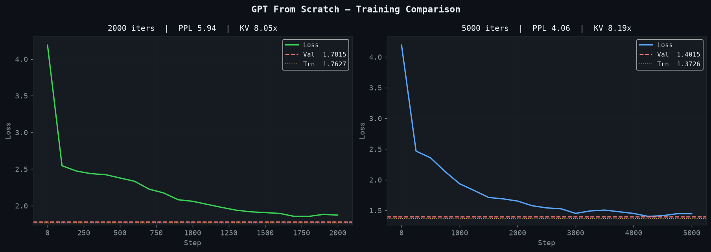
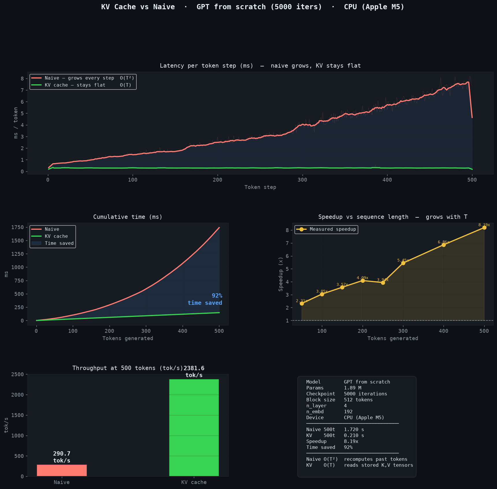
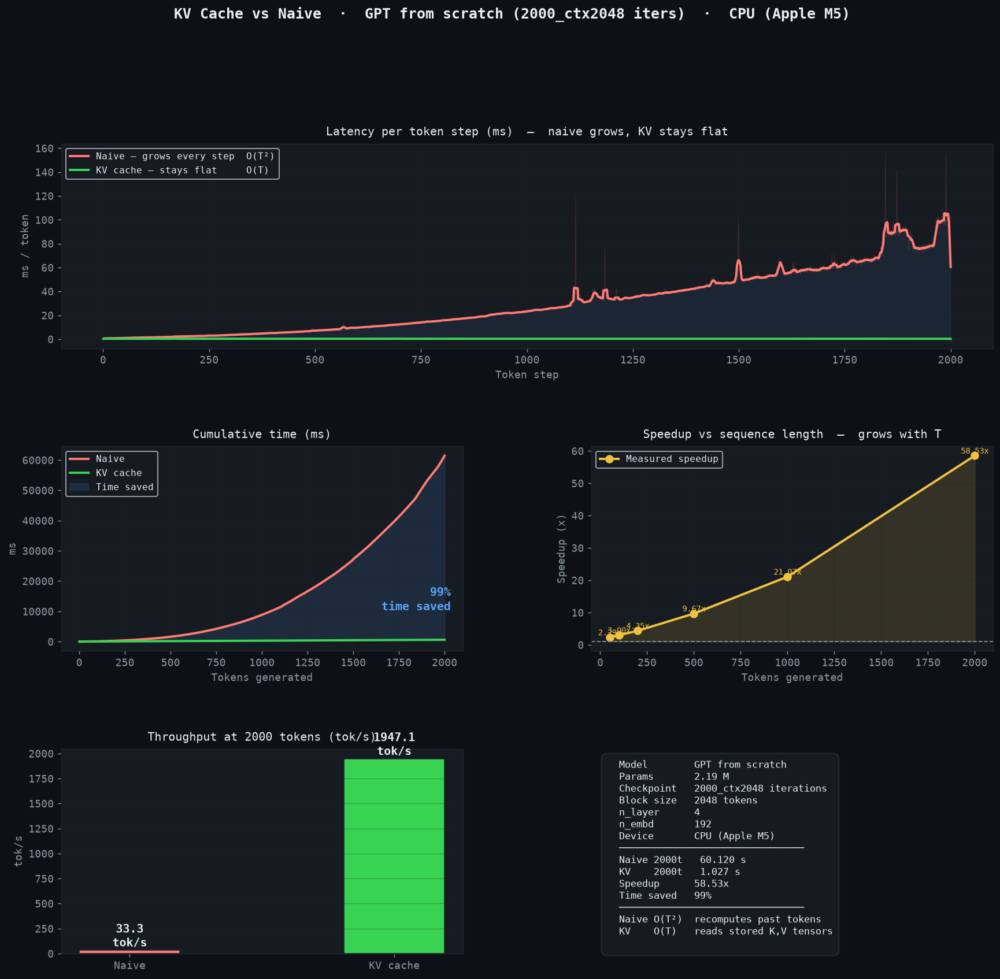

# llm-inference-lab

A GPT-style decoder-only transformer built from scratch in pure PyTorch
(no HuggingFace), with a **KV cache** implemented and benchmarked against
naive autoregressive generation — the classic O(T²) vs. O(T) inference
speedup, measured, not just claimed.

## What's implemented

- **Model** ([`kv_caching/model.py`](kv_caching/model.py)): token + learned
  positional embeddings, `n_layer` pre-norm transformer blocks, weight-tied
  LM head. Character-level tokenizer, trained on TinyShakespeare.
- **Attention** ([`kv_caching/attention.py`](kv_caching/attention.py)):
  multi-head causal self-attention with a **pre-allocated KV buffer**
  path — during decode, K/V for the new token are written in-place into a
  fixed-size buffer (`kv_cache["k"][:, :, cache_pos:cache_pos+T, :] = k`)
  instead of concatenating and reallocating every step.
- **KV-cache generation** ([`kv_caching/model.py`](kv_caching/model.py)
  `_generate_kv`): prefill the prompt once, then decode one token at a
  time reading from the cache — O(T) total instead of the naive path's
  O(T²) (`_generate_naive`, which reprocesses the whole sequence every
  step).
- **Training** ([`kv_caching/trainer.py`](kv_caching/trainer.py)): AdamW +
  cosine LR schedule, gradient clipping, CSV loss logging, checkpointing.
- **Evaluation** ([`kv_caching/evaluate.py`](kv_caching/evaluate.py)):
  perplexity/BPC on train/val splits, a KV-cache-vs-naive benchmark sweep
  with per-step latency and throughput charts, qualitative generation
  samples across temperatures, and side-by-side checkpoint comparison.

## Repo structure

```
llm-inference-lab/
└── kv_caching/
    ├── config.py              # GPTConfig — model hyperparameters
    ├── model.py                # GPT model, KV-cache & naive generate()
    ├── attention.py              # Causal self-attention w/ KV buffer
    ├── transformer_block.py        # Pre-norm block (attn + MLP)
    ├── feedforward.py                # MLP (GELU)
    ├── layer_norm.py                   # LayerNorm w/ optional bias
    ├── positional_encoding.py            # Learned positional embedding
    ├── dataset.py                          # Character-level dataset
    ├── trainer.py                            # Training loop
    ├── inference.py                            # generate_text / benchmark helpers
    ├── evaluate.py                               # Full eval + benchmark + plots
    ├── main.py                                     # CLI: train + quick preview
    ├── input.txt                                     # TinyShakespeare corpus
    ├── checkpoints/                                    # (gitignored — ~11MB each)
    ├── results/                                          # CSV logs, benchmark
    │                                                      tables, plots, samples
    │                                                      (block_size=512 checkpoints)
    └── long_context/                                       # separate block_size=2048
                                                              checkpoint + results, for
                                                              the 1000/2000-token benchmark
```

## Hardware & setup

Model is tiny by design — **1.89M parameters**, `n_layer=4`, `n_embd=192`,
`block_size=512` — so training and inference are both light on any modern
laptop; nothing here needs a datacenter GPU.

```bash
python3 -m venv .venv
source .venv/bin/activate
pip install -r requirements.txt
```

**Training** uses whichever device you pass — on Apple Silicon, `--device
mps` (Apple's GPU backend) trains roughly **2.7x faster** than CPU for
this model with no meaningful extra memory pressure (confirmed on an
Apple M5, 16GB RAM: ~160-300MB resident, one Python process). **Inference
benchmarking** (`evaluate.py`) intentionally stays on CPU — that's the
realistic deployment target for a model this size, and it's what makes
the KV-cache-vs-naive comparison meaningful (comparing two CPU-bound
generation strategies, not conflating the comparison with a GPU speedup).

```bash
cd kv_caching

# train (~10 min for 2000 iters on Apple Silicon MPS, ~40 min for 5000)
# --device auto-detects cuda > mps > cpu; pass --device cpu to force CPU
python main.py --iters 2000
python main.py --iters 5000

# full evaluation + KV-cache benchmark + plots, on CPU
python evaluate.py --iters 2000
python evaluate.py --iters 5000
python evaluate.py --compare        # side-by-side once both checkpoints exist

# 1000/2000-token benchmark: needs a checkpoint trained with a bigger
# context window (block_size=512's KV cache silently caps at 512 tokens)
python -c "from trainer import train; train(max_iters=2000, batch_size=4, \
  save_dir='long_context', device='mps', block_size=2048)"
python -c "
from evaluate import load_checkpoint, kv_cache_benchmark
model, ds, ckpt = load_checkpoint('long_context/checkpoints/ckpt_2000iters.pt', 'cpu')
kv_cache_benchmark(model, ds, 'cpu', save_dir='long_context', iters='2000_ctx2048',
                    sweep_lengths=[50, 100, 200, 500, 1000, 2000])
"
```

## Results

Two checkpoints, same architecture, same corpus (TinyShakespeare,
1,115,394 chars), trained on this machine (Apple M5, MPS) and benchmarked
on its CPU.

### Language modeling quality

| Iterations | Val Perplexity | Val BPC | Train loss | Val loss | Overfit gap |
|---|---|---|---|---|---|
| 2000 | 5.94 | 2.570 | 1.763 | 1.782 | +0.019 |
| 5000 | **4.06** | **2.022** | 1.373 | 1.402 | +0.029 |

Both fit well (no meaningful overfitting — the tiny gap is expected and
healthy). Per `evaluate.py`'s own grading, 5000 iterations crosses from
"Good — coherent text with recognisable style" (PPL 5.94) into
"Excellent — strongly learned Shakespeare patterns" (PPL 4.06).



### KV cache vs. naive generation (the actual point of this repo)

At 500 generated tokens, CPU (Apple M5), 5000-iteration checkpoint:

| Metric | Naive | KV cache |
|---|---|---|
| Time (500 tokens) | 1.720 s | 0.210 s |
| Throughput | 290.7 tok/s | 2381.6 tok/s |
| **Speedup** | | **8.19x** |

And the speedup **grows with sequence length**, exactly as the O(T²) vs.
O(T) theory predicts — at 50 tokens it's only 2.3x, by 500 tokens it's
8.2x:

| Tokens generated | 50 | 100 | 150 | 200 | 250 | 300 | 400 | 500 |
|---|---|---|---|---|---|---|---|---|
| Speedup | 2.33x | 3.05x | 3.57x | 4.09x | 3.94x | 5.45x | 6.86x | 8.19x |



**Worth noting:** the speedup is ~8.2x for both the 2000-iter (8.05x) and
5000-iter (8.19x) checkpoints — nearly identical despite very different
language-modeling quality. That's the expected result: the KV cache's
speedup comes from the caching *mechanism* (avoiding O(T²) recomputation),
not from anything about how well-trained the model is. Two independent
things, confirmed independent.

### Longer sequences: the speedup keeps growing

The default checkpoints above were trained with a 512-token context limit
(`block_size=512`), which caps how far the 500-token sweep point could
go. To test 1000 and 2000 tokens honestly, a separate checkpoint was
trained with `block_size=2048`
([`kv_caching/long_context/`](kv_caching/long_context/)) — a real
architectural constraint, not a benchmark artifact: this repo's KV cache
is a fixed-size, non-rotating buffer sized to `block_size`, and the
learned positional embeddings only cover positions up to `block_size`, so
generation beyond that isn't currently supported (see Limitations).

| Tokens generated | Naive | KV cache | Speedup |
|---|---|---|---|
| 50 | 0.042 s | 0.018 s | 2.29x |
| 500 | 1.980 s | 0.205 s | 9.67x |
| 1000 | 9.120 s | 0.433 s | 21.07x |
| **2000** | **60.120 s** | **1.027 s** | **58.53x** |



At 2000 tokens, naive generation takes a full minute; KV cache does the
same generation in about a second — 99% of the wall-clock time saved.
This is the clearest demonstration in this repo of *why* KV caching is
not optional for any real autoregressive deployment: the naive cost curve
is not just slower, it's a different growth rate entirely.

### Sample generations (5000-iter checkpoint, temp=0.6)

```
HAMLET:
How is hart now, pray my my soul deep thy shall not so shall be
That lose so-man heart that the should of his him.

First the glady be his pack of was deceived.

DUKE OF YORK:
Yes, my lord, brave the made the sensenses
In my hoest very of his soften's speak.
```

Character-level, not word-level — so this is not grammatical English, but
it's clearly learned real structure: character names in the right format,
line breaks matching play formatting, plausible-looking Early Modern
English word fragments. That's what a ~1.9M-parameter char-level model
trained for a few thousand steps should produce — a GPT-3-scale model
this is not, and it isn't trying to be. Full samples at every temperature:
[`results/samples_5000iters.txt`](kv_caching/results/samples_5000iters.txt).

## Why the speedup happens

Naive autoregressive generation reprocesses the *entire* sequence through
every transformer layer at every new token — generating token T costs
O(T) work, so generating N tokens total costs O(N²). The KV cache exploits
the fact that each layer's attention only needs the past tokens' K and V
vectors (not to recompute them) — cache them once during a prefill pass,
then each new token only needs one forward pass over the *new* token,
reading the rest from the cache: O(1) per token, O(N) total. That
quadratic-vs-linear gap is exactly what the growing speedup-vs-length
table above shows.

## Limitations & honest scope

- **No sliding-window / rotating cache** — the KV buffer is fixed-size,
  allocated to `block_size` and never evicts old entries, and positional
  embeddings are a learned absolute table also sized to `block_size`.
  Generation silently stops once total length hits `block_size` (this
  was caught during benchmarking — see "Longer sequences" above — and
  `evaluate.py`'s benchmark now asserts loudly instead of measuring a
  truncated run). Supporting arbitrarily long generation would need a
  rotating buffer plus relative positional encoding (RoPE/ALiBi) instead
  of the current learned absolute embeddings — noted here rather than
  silently worked around.
- Char-level tokenization on a tiny (1.1MB) corpus — this demonstrates the
  KV-cache mechanism correctly, it is not a demonstration of strong
  language modeling at scale.
- Benchmarked on one machine (Apple M5) — absolute tok/s numbers won't
  transfer to other hardware, but the *shape* of the result (growing
  speedup with sequence length, training-quality-independent) is the
  architecture-level finding that should hold generally.
- No batched-decode or multi-GPU benchmarking — this is single-sequence,
  single-device generation only.
